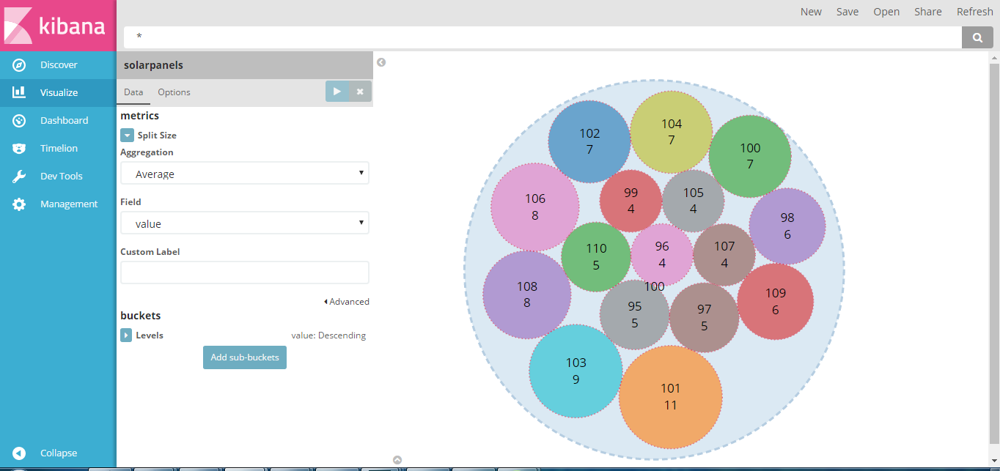

# Kibana Circles Packing Visualization Plugin

This is a Circles Packing diagram visType for Kibana, version 6.0.0-alpha1.

This plugin is based on the excelent work done by @chenryn with the
kbn_sankey_vis [plugin](https://github.com/chenryn/kbn_sankey_vis) (Thanks!), and of course on the exceptional D3 library,
by @mbostock [D3 Gallery](https://github.com/mbostock/d3/wiki/Gallery) (Also, Thanks!).

If you really liked this and feel like making a donation : <a href="https://www.paypal.com/cgi-bin/webscr?cmd=_donations&business=juan.carniglia@gmail.com&lc=AR&item_name=JuanCarniglia&item_number=1000&currency_code=USD&bn=PP-DonationsBF:btn_donate_LG.gif:NonHosted">

</a>


(Only one level is shown here, there can be up to two levels for now, have to work on the code some more).

##Installation Steps

(Theses are optional, you can just copy the kbn_circles_vis folder into
KIBANA_HOME/src/plugins).

```
git clone https://github.com/JuanCarniglia/kbn_circles_vis.git
cd kbn_circles_vis
npm install
npm run build
cp -R build/kbn_circles_vis/ KIBANA_HOME/installedPlugins
```
** Note that in NTFS file systems, file paths that exceed 260 characters will fail with cp, you have to use ROBOCOPY:

```
robocopy /S build/kbn_circles_vis KIBANA_FOLDER_PATH/installedPlugins/kbn_circles_vis
```

** Also note that if npm run build fails, with a rsync.js error, it is likelly that you don't have RSYNC.EXE installed
in your system, and also that you don't have it on your PATH environment variable.

Install it from https://www.itefix.net/cwrsync and run:

```
set PATH=%PATH%;{rsync installation directory}\bin
```

##How does it work

Basically, this plugin takes the information from Elasticsearch, generates a JSON structure similar to
what is expected by the D3 Circle Packing code, which is:

```json
{
  "name": "flare",
  "children": [
    {
      "name": "something",
      "children": [
        {
          "name": "some_other",
          "children": null,
          "size": 138
        },
        {
          "name": "some_other_other",
          "children": null,
          "size": 305
        }
      ],
      "size": 443
    }
  ]
}
```
And generates two levels of circles. One root, and two other levels, to be exact.

The size of the circles are related to the "size" value.

The whole chart (Canvas) can be panned and zoomed in-out.
